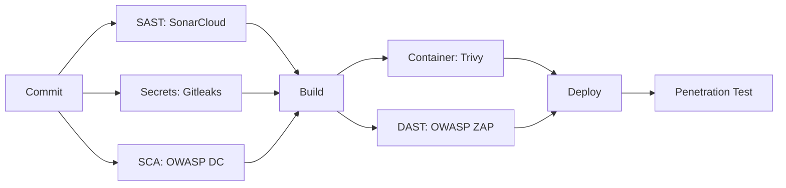

# Kartezy Enterprise Security Guide

## 1. Compliance Framework

Kartezy is designed to meet the following compliance standards:

| Standard | Status | Scope |
|----------|--------|-------|
| **OWASP Top 10 (2021)** | ✅ Implemented | All web applications |
| **PCI DSS v4.0** | 🔶 Partially | Payment processing |
| **ISO 27001:2022** | 🔶 Documentation Ready | Information security management |
| **SOC 2 Type II** | 🔶 Controls in Place | Security, availability, processing integrity |
| **GDPR** | ✅ Implemented | EU user data protection |
| **India DPDP Act 2023** | ✅ Implemented | Indian user data protection |

---

## 2. PCI DSS Compliance

### 2.1 Scope
Kartezy processes cardholder data through Razorpay integration. Card data never touches our servers directly.

### 2.2 Controls

| Requirement | Status | Implementation |
|-------------|--------|----------------|
| **Build and Maintain a Secure Network** | ✅ | Firewall rules, secure configurations |
| **Protect Cardholder Data** | ✅ | Tokenization via Razorpay, AES-256 encryption |
| **Maintain Vulnerability Management** | ✅ | SAST, DAST, dependency scanning in CI/CD |
| **Implement Strong Access Control** | ✅ | RBAC, MFA, session management, least privilege |
| **Regularly Monitor and Test Networks** | ✅ | Audit logging, security headers, WAF rules |
| **Maintain Information Security Policy** | ✅ | Documented in this guide |

### 2.3 Key PCI DSS Controls
- Card data never stored on our infrastructure (Razorpay iframe/fetch API)
- All API communications over TLS 1.2+
- Webhook HMAC verification (SHA-256)
- Access control with principle of least privilege
- Audit logging with tamper-evident hashing
- Quarterly vulnerability scans

---

## 3. ISO 27001 Compliance

### 3.1 Annex A Controls

| Control Domain | Status | Implementation |
|----------------|--------|----------------|
| **A.5 Information Security Policies** | ✅ | Security policy, coding standards |
| **A.6 Organization of Information Security** | ✅ | RBAC, segregation of duties |
| **A.7 Human Resource Security** | ✅ | Background checks, NDAs, training |
| **A.8 Asset Management** | ✅ | Asset inventory, acceptable use |
| **A.9 Access Control** | ✅ | JWT, OAuth2, RBAC, MFA, session management |
| **A.10 Cryptography** | ✅ | AES-256, BCrypt, TLS 1.2+ |
| **A.11 Physical & Environmental Security** | ✅ | Cloud infrastructure security |
| **A.12 Operations Security** | ✅ | CI/CD, monitoring, backup procedures |
| **A.13 Communications Security** | ✅ | mTLS, API Gateway, WAF, network policies |
| **A.14 System Acquisition & Development** | ✅ | Secure SDLC, code review, SAST |
| **A.15 Supplier Relationships** | ✅ | Third-party risk assessment |
| **A.16 Incident Management** | ✅ | Incident response plan |
| **A.17 Business Continuity** | ✅ | DR plan, multi-region architecture |
| **A.18 Compliance** | ✅ | Legal, regulatory, contractual compliance |

---

## 4. SOC 2 Controls

### 4.1 Trust Services Criteria

| Category | Status | Implementation |
|----------|--------|----------------|
| **Security** | ✅ | Firewalls, IDS/IPS, WAF, RBAC, MFA |
| **Availability** | ✅ | HA architecture, multi-region deployment |
| **Processing Integrity** | ✅ | Idempotency keys, event sourcing |
| **Confidentiality** | ✅ | AES-256 encryption, data classification |
| **Privacy** | ✅ | GDPR/DPDP Act compliance, data minimization |

### 4.2 Key SOC 2 Controls
- Change management with CI/CD pipeline
- Logical and physical access controls
- System monitoring and logging
- Incident response procedures
- Risk assessment and management
- Vendor management program
- Data backup and recovery procedures

---

## 5. GDPR Compliance

### 5.1 Data Subject Rights

| Right | Status | Endpoint |
|-------|--------|----------|
| **Right to be Informed** | ✅ | Privacy policy, consent collection |
| **Right of Access** | ✅ | `GET /auth/privacy/export-data` |
| **Right to Rectification** | ✅ | Profile update endpoints |
| **Right to Erasure** | ✅ | `POST /auth/privacy/delete-account` |
| **Right to Restrict Processing** | ✅ | Privacy settings |
| **Right to Data Portability** | ✅ | `GET /auth/privacy/export-data` |
| **Right to Object** | ✅ | Marketing preferences, opt-out |
| **Rights related to Automated Decision-making** | ✅ | Human review for automated actions |

### 5.2 GDPR Documentation
- Data Processing Agreement (DPA) available
- Data Retention Policy (configurable, default 365 days)
- Data Breach Notification Procedure (<72 hours)
- Data Protection Impact Assessment (DPIA) completed
- Records of Processing Activities (ROPA) maintained

---

## 6. India DPDP Act 2023 Compliance

### 6.1 Key Requirements

| Requirement | Status | Implementation |
|-------------|--------|----------------|
| **Consent Management** | ✅ | Explicit consent at data collection points |
| **Purpose Limitation** | ✅ | Data used only for specified purposes |
| **Data Minimization** | ✅ | Collect only necessary data |
| **Storage Limitation** | ✅ | Data retention policies enforced |
| **Data Principal Rights** | ✅ | Access, correction, erasure, portability |
| **Data Fiduciary Obligations** | ✅ | Security safeguards, breach notification |
| **Data Processor Obligations** | ✅ | Contractual agreements with processors |
| **Cross-border Data Transfer** | ✅ | Data localization for sensitive data |

### 6.2 DPDP Act Controls
- Consent records maintained with timestamps
- Data retention schedules enforced (PrivacyService.enforceDataRetention)
- Data breach notification within 72 hours
- Data Protection Officer (DPO) contact available
- Grievance redressal mechanism implemented

---

## 7. Security Architecture

### 7.1 Defense in Depth

```
Layer 7: Application Security
  ├── Input validation (@Valid, OWASP patterns)
  ├── Output encoding
  ├── CSRF protection (when applicable)
  └── @PreAuthorize on all endpoints

Layer 6: API Gateway
  ├── JWT validation (Oauth2TokenValidationFilter)
  ├── Rate limiting (AdvancedRateLimiter)
  ├── Bot detection (BotProtectionFilter)
  ├── Threat protection (ApiThreatProtectionFilter)
  └── Request/Response logging (RequestResponseLogger)

Layer 5: Service Security
  ├── Service-to-service authentication
  ├── mTLS communication
  └── Internal token validation

Layer 4: Data Security
  ├── AES-256 encryption at rest
  ├── BCrypt for passwords
  ├── Encrypted database fields
  └── Secure backups

Layer 3: Network Security
  ├── TLS 1.2+ for all communications
  ├── Kubernetes network policies
  ├── Firewall rules
  └── Private subnet for services

Layer 2: Infrastructure Security
  ├── Container image scanning (Trivy)
  ├── OS hardening
  ├── Secrets management (Vault)
  └── Regular patching

Layer 1: Physical Security
  ├── Cloud provider security (AWS/GCP)
  ├── Data center physical controls
  └── Multi-region redundancy
```

### 7.2 Security Pipeline (CI/CD)



---

## 8. Incident Response Plan

### 8.1 Severity Levels

| Severity | Definition | Response Time |
|----------|------------|---------------|
| **P0 - Critical** | Data breach, service outage | 15 minutes |
| **P1 - High** | Authentication bypass, payment fraud | 30 minutes |
| **P2 - Medium** | Rate limiting bypass, policy violation | 2 hours |
| **P3 - Low** | Minor configuration issues | 24 hours |
| **P4 - Informational** | Security recommendations | Next sprint |

### 8.2 Incident Response Flow
1. **Detection** - Automated monitoring, alerts, audit log analysis
2. **Triage** - Assess severity, assign responder
3. **Containment** - Isolate affected systems, revoke compromised credentials
4. **Eradication** - Remove threat, patch vulnerability
5. **Recovery** - Restore from clean backup, verify integrity
6. **Post-mortem** - Root cause analysis, preventive measures

---

## 9. Security Testing Schedule

| Test Type | Frequency | Tool |
|-----------|-----------|------|
| SAST (Static Analysis) | Every commit | SonarCloud, SpotBugs |
| SCA (Dependency Scan) | Every commit | OWASP Dependency Check |
| Secrets Scan | Every commit | Gitleaks, TruffleHog |
| Container Scan | Every commit | Trivy |
| DAST (Dynamic Analysis) | Weekly | OWASP ZAP |
| Penetration Test | Quarterly | External vendor |
| Bug Bounty | Continuous | HackerOne |

---

## 10. Emergency Contacts

| Role | Contact | Response Time |
|------|---------|---------------|
| **CISO** | security@kartezy.com | 24/7 |
| **Security Engineer** | infra@kartezy.com | 24/7 |
| **DPO** | dpo@kartezy.com | Business hours |
| **Incident Response** | incident@kartezy.com | 24/7 |

---

*Document Version: 1.0*
*Last Updated: July 2026*
*Review Cycle: Quarterly*
