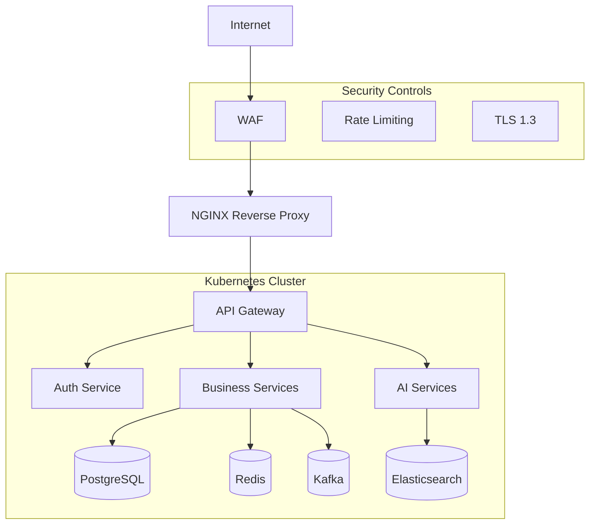

# Kartezy Security Guide

## 1. Security Architecture

### Authentication & Authorization
- **JWT-based authentication** with access tokens (24h expiry) and refresh tokens (7d expiry)
- **RBAC** with predefined roles: CUSTOMER, MERCHANT, DELIVERY_PARTNER, ADMIN, SUPER_ADMIN
- **OAuth2 ready** with Google and Facebook SSO
- **Multi-factor authentication** support via OTP

### Network Security
- **TLS 1.2/1.3** for all external communications
- **Network policies** for pod-to-pod communication isolation
- **API Gateway** as single entry point for all services
- **NGINX** as reverse proxy with rate limiting and WAF capabilities

## 2. Security Measures Implemented

### OWASP Top 10 Protection

| OWASP Category | Implementation |
|---------------|---------------|
| **Broken Access Control** | RBAC, JWT validation, API Gateway routing |
| **Cryptographic Failures** | TLS everywhere, bcrypt for passwords, AES-256 for sensitive data |
| **Injection** | Parameterized queries (JPA/Hibernate), input validation |
| **Insecure Design** | Micro-segmentation, least privilege |
| **Security Misconfiguration** | Centralized config server, secret management |
| **Vulnerable Components** | Regular dependency scanning (Trivy, Dependabot) |
| **Auth Failures** | JWT rotation, session management, MFA |
| **Data Integrity** | Signed JWTs, event sourcing for critical operations |
| **Logging Failures** | Centralized logging, audit trails |
| **SSRF** | Network policies, restricted egress |

### CSRF Protection
- State-changing operations require JWT
- SameSite cookies for web sessions
- CORS configured per service

### XSS Protection
- Content Security Policy headers
- Input sanitization on all user inputs
- React/Next.js auto-escaping

### SQL Injection Protection
- JPA/Hibernate with parameterized queries
- No raw SQL concatenation
- Input validation on all endpoints

## 3. Secrets Management

### Development
- `.env` files (gitignored)
- Placeholder values in `.env.template`

### Production
- **External Secrets Manager**: AWS Secrets Manager, HashiCorp Vault, or Azure Key Vault
- **Sealed Secrets**: Bitnami Sealed Secrets for GitOps
- **Rotation**: Automated rotation via external secrets operator

## 4. Data Protection

### Encryption At Rest
- PostgreSQL: TDE or disk-level encryption
- MongoDB: Encrypted storage engine
- Redis: AOF persistence with encryption
- Elasticsearch: Encrypted at filesystem level

### Encryption In Transit
- TLS 1.2+ for all external communications
- mTLS for inter-service communication (Istio/Linkerd)
- Kafka TLS for message encryption

### Personally Identifiable Information (PII)
- **Classification**: All user data treated as sensitive
- **Masking**: PII masked in logs
- **Retention**: 90 days default, configurable
- **Deletion**: GDPR-compliant deletion procedures
- **Anonymization**: Analytics data anonymized after retention period

## 5. API Security

### Rate Limiting
- **Auth endpoints**: 10 requests/minute per IP
- **General API**: 100 requests/second per IP
- **WebSocket**: 100 connections per IP

### Request Validation
- Input validation on all endpoints
- Request size limits (10MB max)
- Content-Type validation
- API key validation for external integrations

### JWT Security
```yaml
# JWT Configuration
jwt:
  secret: ${JWT_SECRET}          # 256-bit minimum
  expiration: 86400000           # 24 hours
  refresh-expiration: 604800000  # 7 days
  issuer: kartezy
  audience: kartezy-api
```

## 6. Infrastructure Security

### Kubernetes Security
- **Pod Security Standards**: Restricted baseline
- **Network Policies**: Default deny, allow by necessity
- **RBAC**: Least privilege for service accounts
- **Pod Anti-Affinity**: Spread across nodes
- **Resource Limits**: CPU/Memory limits enforced
- **ReadOnly Root Filesystem**: For stateless services
- **Run As Non-Root**: All containers run as non-root user

### Container Security
- **Minimal Base Images**: Alpine Linux
- **No Root**: `USER` directive in Dockerfiles
- **Read-only filesystem**: Where possible
- **Security Scanning**: Trivy in CI/CD pipeline
- **Vulnerability patching**: Weekly automated scans

## 7. Audit Logging

### Audit Events
| Event Type | Logged Data | Retention |
|-----------|-------------|-----------|
| Authentication | User, IP, timestamp, success/failure | 1 year |
| Authorization | Resource, action, result | 1 year |
| Data Changes | Entity, old value, new value, user | 90 days |
| Configuration | Changed setting, old/new value | 1 year |
| Security Events | Type, severity, details | 2 years |

### Logging Infrastructure
- **Centralized**: All logs to stdout (JSON format)
- **Shipping**: Fluentd/Fluent Bit → Elasticsearch/Loki
- **Storage**: 30 days hot, 1 year warm, 2 years cold
- **Access**: Admin-only with audit trail

## 8. Incident Response

### Security Incident Response Plan

1. **Identification**: Monitoring alerts, user reports, security scan findings
2. **Containment**: 
   - Isolate affected services
   - Revoke compromised credentials
   - Block malicious IPs
3. **Eradication**:
   - Patch vulnerability
   - Remove malware/backdoors
   - Rotate all secrets
4. **Recovery**:
   - Restore from clean backup
   - Verify system integrity
   - Gradual traffic restoration
5. **Post-Mortem**:
   - Root cause analysis
   - Timeline documentation
   - Preventive measures

### Contact
- **Security Team**: security@kartezy.com
- **Bug Bounty**: bounty@kartezy.com
- **Emergency**: +91-XXX-XXX-XXXX

## 9. Compliance

### Data Protection
- **GDPR**: Right to access, deletion, data portability
- **PCI DSS**: Payment data handled by payment gateway
- **SOC 2**: System availability and security controls

### Regional Requirements
- **India**: IT Act 2000, Digital Personal Data Protection Act
- **GDPR**: For EU customers
- **CCPA**: For California customers
- **LGPD**: For Brazil customers

## 10. Security Checklist

### Pre-Deployment
- [ ] All secrets externalized
- [ ] TLS certificates valid
- [ ] Rate limiting configured
- [ ] Network policies applied
- [ ] No hardcoded credentials
- [ ] Dependency scan clean
- [ ] Security headers configured
- [ ] Audit logging enabled

### Daily Operations
- [ ] Review security alerts
- [ ] Check dependency vulnerabilities
- [ ] Verify backup integrity
- [ ] Review access logs for anomalies
- [ ] Monitor error rates

### Monthly
- [ ] Vulnerability scan
- [ ] Penetration test (quarterly)
- [ ] Access review
- [ ] Secret rotation check
- [ ] Compliance documentation update

## 11. Network Security Architecture



## 12. Dependency Security

### Automated Scanning
- **Trivy**: Filesystem and container image scanning
- **Dependency Check**: OWASP Dependency Check for Java
- **Dependabot**: GitHub automated PRs for vulnerable dependencies
- **Snyk**: Real-time vulnerability monitoring

### Update Cadence
- **Critical CVEs**: Patch within 24 hours
- **High CVEs**: Patch within 7 days
- **Medium CVEs**: Patch within 30 days
- **Low CVEs**: Patch within 90 days
